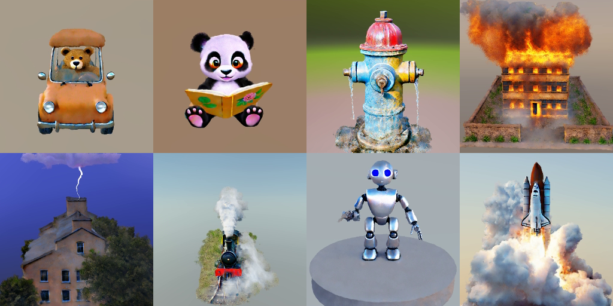

# 4D-fy - threestudio



| [Project Page](https://sherwinbahmani.github.io/4dfy/) | [Paper](https://arxiv.org/abs/2311.17984) | [User Study Template](https://github.com/victor-rong/video-generation-study) | [threestudio extension](https://github.com/DSaurus/threestudio-4dfy) |

- **This code is forked from [threestudio](https://github.com/threestudio-project/threestudio).**

## Installation

### Install threestudio

**This part is the same as original threestudio. Skip it if you already have installed the environment.**

- You must have an NVIDIA graphics card with at least 24 GB VRAM and have [CUDA](https://developer.nvidia.com/cuda-downloads) installed.
- Install `Python >= 3.8`.
- (Optional, Recommended) Create a virtual environment:

```sh
python3 -m virtualenv venv
. venv/bin/activate

# Newer pip versions, e.g. pip-23.x, can be much faster than old versions, e.g. pip-20.x.
# For instance, it caches the wheels of git packages to avoid unnecessarily rebuilding them later.
python3 -m pip install --upgrade pip
```

- Install `PyTorch >= 1.12`. We have tested on `torch1.12.1+cu113` and `torch2.0.0+cu118`, but other versions should also work fine.

```sh
# torch1.12.1+cu113
pip install torch==1.12.1+cu113 torchvision==0.13.1+cu113 --extra-index-url https://download.pytorch.org/whl/cu113
# or torch2.0.0+cu118
pip install torch torchvision --index-url https://download.pytorch.org/whl/cu118
```

- (Optional, Recommended) Install ninja to speed up the compilation of CUDA extensions:

```sh
pip install ninja
```

- Install dependencies:

```sh
pip install -r requirements.txt
```

### Install MVDream
MVDream multi-view diffusion model is provided in a different codebase. Install it by:

```sh
git clone https://github.com/bytedance/MVDream extern/MVDream
pip install -e extern/MVDream 
```

## Quickstart

Our model is trained in 3 stages and there are three different config files for every stage. Training has to be resumed after finishing a stage.

```sh
seed=0
gpu=0
exp_root_dir=/path/to

# Original configs used in paper with 80 GB GPU memory

# Stage 1
# python launch.py --config configs/fourdfy_stage_1.yaml --train --gpu $gpu exp_root_dir=$exp_root_dir seed=$seed system.prompt_processor.prompt="a panda dancing"

# Stage 2
# ckpt=/path/to/fourdfy_stage_1/a_panda_dancing@timestamp/ckpts/last.ckpt
# python launch.py --config configs/fourdfy_stage_2.yaml --train --gpu $gpu exp_root_dir=$exp_root_dir seed=$seed system.prompt_processor.prompt="a panda dancing" system.weights=$ckpt

# Stage 3
# ckpt=/path/to/fourdfy_stage_2/a_panda_dancing@timestamp/ckpts/last.ckpt
# python launch.py --config configs/fourdfy_stage_3.yaml --train --gpu $gpu exp_root_dir=$exp_root_dir seed=$seed system.prompt_processor.prompt="a panda dancing" system.weights=$ckpt

# Low memory configs for 24-48 GB GPU memory

# Stage 1
# python launch.py --config configs/fourdfy_stage_1_low_vram.yaml --train --gpu $gpu exp_root_dir=$exp_root_dir seed=$seed system.prompt_processor.prompt="a panda dancing"

# Stage 2
# ckpt=/path/to/fourdfy_stage_1_low_vram/a_panda_dancing@timestamp/ckpts/last.ckpt
# python launch.py --config configs/fourdfy_stage_2_low_vram.yaml --train --gpu $gpu exp_root_dir=$exp_root_dir seed=$seed system.prompt_processor.prompt="a panda dancing" system.weights=$ckpt

# Stage 3
# ckpt=/path/to/fourdfy_stage_2_low_vram/a_panda_dancing@timestamp/ckpts/last.ckpt
# python launch.py --config configs/fourdfy_stage_3_low_vram.yaml --train --gpu $gpu exp_root_dir=$exp_root_dir seed=$seed system.prompt_processor.prompt="a panda dancing" system.weights=$ckpt


### Alternatives
# Use VideoCrafter2 in stage 3

# ckpt=/path/to/fourdfy_stage_2/a_panda_dancing@timestamp/ckpts/last.ckpt
# python launch.py --config configs/fourdfy_stage_3_vc.yaml --train --gpu $gpu exp_root_dir=$exp_root_dir seed=$seed system.prompt_processor.prompt="a panda dancing" system.weights=$ckpt

# ckpt=/path/to/fourdfy_stage_2_low_vram/a_panda_dancing@timestamp/ckpts/last.ckpt
# python launch.py --config configs/fourdfy_stage_3_low_vram_vc.yaml --train --gpu $gpu exp_root_dir=$exp_root_dir seed=$seed system.prompt_processor.prompt="a panda dancing" system.weights=$ckpt

# Use deformation based approach to preserve quality in dynamic stage

# Stage 1
# python launch.py --config configs/fourdfy_stage_1_low_vram_deformation.yaml --train --gpu $gpu exp_root_dir=$exp_root_dir seed=$seed system.prompt_processor.prompt="a panda dancing"

# Stage 2
# ckpt=/path/to/fourdfy_stage_1_low_vram_deformation/a_panda_dancing@timestamp/ckpts/last.ckpt
# python launch.py --config configs/fourdfy_stage_2_low_vram_deformation.yaml --train --gpu $gpu exp_root_dir=$exp_root_dir seed=$seed system.prompt_processor.prompt="a panda dancing" system.weights=$ckpt

# Stage 3: Low memory configs for 24-48 GB GPU memory
# ckpt=/path/to/fourdfy_stage_2_low_vram_deformation/a_panda_dancing@timestamp/ckpts/last.ckpt
# python launch.py --config configs/fourdfy_stage_3_low_vram_vc_deformation.yaml --train --gpu $gpu exp_root_dir=$exp_root_dir seed=$seed system.prompt_processor.prompt="a panda dancing" system.weights=$ckpt

# Stage 3
# ckpt=/path/to/fourdfy_stage_2_low_vram_deformation/a_panda_dancing@timestamp/ckpts/last.ckpt
# python launch.py --config configs/fourdfy_stage_3_vc_deformation.yaml --train --gpu $gpu exp_root_dir=$exp_root_dir seed=$seed system.prompt_processor.prompt="a panda dancing" system.weights=$ckpt
```

## Memory Usage
Depending on the text prompt, stage 3 might not fit on a 24-48 GB GPU, we trained our final models with an 80 GB GPU.
There are ways to reduce memory usage to fit on smaller GPUs:
- Use the _low_vram config files instead of the original ones
- If it still does not fit your GPU memory, you can reduce system.renderer.base_renderer.train_max_nums
- Another way is to reduce the rendering resolution for the video model with data.single_view.width_vid=144 and data.single_view.height_vid=80 (or even data.single_view.width_vid=72 and data.single_view.height_vid=40)
- Mixed precision: trainer.precision=16-mixed
- Memory efficient attention: Set system.guidance_video.enable_memory_efficient_attention=true
- Furthermore, by setting data.single_view.num_frames=8, the number of frames can be reduced
- Reducing the hash grid capacity in system.geometry.pos_encoding_config, e.g., system.geometry.pos_encoding_config.n_levels=8. For this, retraining of the first two stages is required though.

## More tips
- **More motion**. To increase the motion, the learning rate for the video model can be increased to system.loss.lambda_sds_video=0.3 or system.loss.lambda_sds_video=0.5.
- **Use VideoCrafter2 video guidance**. In the paper we used ZeroScope, but there is an option in the train.sh to use VideoCrafter2 instead for more motion and higher quality.
- **Use deformation based approach**. Instead of adding features from a static and dynamic hash grid, we also provide a deformation based approach in the train.sh to keep the static quality and only learn a deformation based motion.

## Credits

This code is built on the [threestudio-project](https://github.com/threestudio-project/threestudio), [MVDream-threestudio](https://github.com/bytedance/MVDream-threestudio), and [VideoCrafter](https://github.com/AILab-CVC/VideoCrafter). Thanks to the maintainers for their contribution to the community!

## Citing

If you find 4D-fy helpful, please consider citing:

```
@article{bahmani20234d,
  title={4D-fy: Text-to-4D Generation Using Hybrid Score Distillation Sampling},
  author={Bahmani, Sherwin and Skorokhodov, Ivan and Rong, Victor and Wetzstein, Gordon and Guibas, Leonidas and Wonka, Peter and Tulyakov, Sergey and Park, Jeong Joon and Tagliasacchi, Andrea and Lindell, David B.},
  journal={arXiv preprint arXiv:2311.17984},
  year={2023}
}
```
